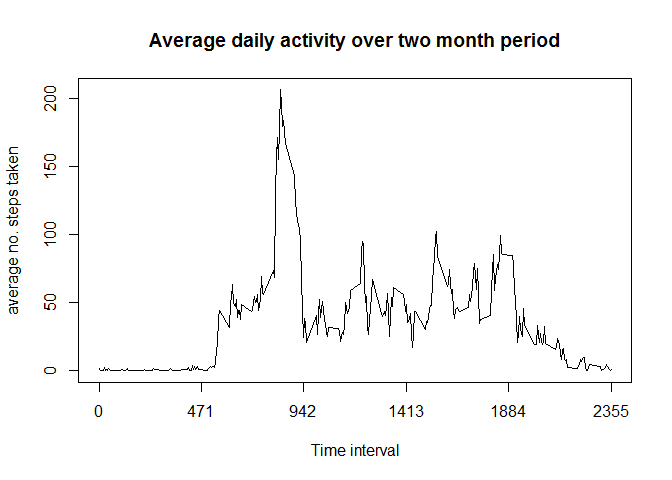

# Reproducible Research: Peer Assessment 1


### Introduction:
This markdown document...


### Loading and preprocessing the data


```r
data <- read.csv("activity.csv", header=T)
library(dplyr, quietly= TRUE, warn.conflicts=FALSE)
head(data, 5)
```

```
##   steps       date interval
## 1    NA 2012-10-01        0
## 2    NA 2012-10-01        5
## 3    NA 2012-10-01       10
## 4    NA 2012-10-01       15
## 5    NA 2012-10-01       20
```

```r
tail(data, 5)
```

```
##       steps       date interval
## 17564    NA 2012-11-30     2335
## 17565    NA 2012-11-30     2340
## 17566    NA 2012-11-30     2345
## 17567    NA 2012-11-30     2350
## 17568    NA 2012-11-30     2355
```

### What is the mean total number of steps taken per day?

##### 1. Total steps taken per day

```r
Total <- aggregate(data$steps, list(data$date), FUN= "sum", na.rm= TRUE)
colnames(Total) <- c("Date", "Total_steps")

head(Total, 5)
```

```
##         Date Total_steps
## 1 2012-10-01           0
## 2 2012-10-02         126
## 3 2012-10-03       11352
## 4 2012-10-04       12116
## 5 2012-10-05       13294
```

##### 2. Histogram 

```r
hist(x= Total$Total_steps, breaks= 30, col= "red", main= "Distribution of steps taken per day", xlab= "Steps taken per day", ylab= "no. of Days", xlim= c(0, max(Total$Total_steps)), xaxt= "n")

axis(side=1, at= seq(0, 22000, 2000), labels= TRUE)
```

 


##### 3. Mean and median steps per day

```r
mean <- mean(Total$Total_steps, na.rm= TRUE)
paste("The mean of total steps taken per day is" ,round(mean, 3))
```

```
## [1] "The mean of total steps taken per day is 9354.23"
```

```r
median <- median(Total$Total_steps, na.rm= TRUE)
paste("The median of total steps taken per day is", median)
```

```
## [1] "The median of total steps taken per day is 10395"
```


### What is the average daily activity pattern?

##### 1. Time series plot

```r
av.int <- aggregate(data$steps, list(data$interval), FUN= "mean", na.rm= TRUE)
colnames(av.int) <- c("Interval", "Average")

plot(x= av.int$Interval, y= av.int$Average, type= "l", xaxt= "n", main= "Average daily activity over two month period", xlab= "Time interval", ylab= "average no. steps taken")

axis(side=1, at= seq(0,2355, 471), labels= TRUE)
```

 

##### 2. Most active interval on average

```r
max.int <- subset(x= av.int, subset= Average == max(Average), select= "Interval")

paste("The ", max.int, "th ", "interval is the most active period on average.", sep= "")
```

```
## [1] "The 835th interval is the most active period on average."
```


### Imputting missing values?
##### 1. Total number of NA's in dataset

```r
missing <- sum(is.na(data$steps))
paste("The total number of rows containing missing values (NA's) is", missing)
```

```
## [1] "The total number of rows containing missing values (NA's) is 2304"
```

##### 2. Replacing NA's with mean activity by interval

```r
# I just could not figure out a more efficient way to do this...
data2 <- data
data2[1:288,1] <- av.int[1:288,2]
data2[2017:2304,1] <- av.int[1:288,2]
data2[8929:9216,1] <- av.int[1:288,2]
data2[9793:10080,1] <- av.int[1:288,2]
data2[11233:11520,1] <- av.int[1:288,2]
data2[11521:11808,1] <- av.int[1:288,2]
data2[12673:12960,1] <- av.int[1:288,2]
data2[17281:17568,1] <- av.int[1:288,2]

head(data2, 7)
```

```
##       steps       date interval
## 1 1.7169811 2012-10-01        0
## 2 0.3396226 2012-10-01        5
## 3 0.1320755 2012-10-01       10
## 4 0.1509434 2012-10-01       15
## 5 0.0754717 2012-10-01       20
## 6 2.0943396 2012-10-01       25
## 7 0.5283019 2012-10-01       30
```

```r
tail(data2, 7)
```

```
##           steps       date interval
## 17562 1.5849057 2012-11-30     2325
## 17563 2.6037736 2012-11-30     2330
## 17564 4.6981132 2012-11-30     2335
## 17565 3.3018868 2012-11-30     2340
## 17566 0.6415094 2012-11-30     2345
## 17567 0.2264151 2012-11-30     2350
## 17568 1.0754717 2012-11-30     2355
```

##### 4. Histogram with mean & median summaries

```r
Total2 <- aggregate(data2$steps, list(data2$date), FUN= "sum", na.rm= TRUE)
colnames(Total2) <- c("Date", "Total_steps")

par(mfrow= c(1,2))

hist(x= Total$Total_steps, breaks= 30, col= "red", main= "(Original) Distribution of steps taken per day", xlab= "Steps taken per day", ylab= "no. of Days", xlim= c(0, max(Total$Total_steps)), xaxt= "n")

axis(side=1, at= seq(0, 22000, 2000), labels= TRUE)

hist(x= Total2$Total_steps, breaks= 30, col= "red", main= "Distribution of steps taken per day (NA's replaced)", xlab= "Steps taken per day", ylab= "no. of Days", xlim= c(0, max(Total2$Total_steps)), xaxt= "n")

axis(side=1, at= seq(0, 22000, 2000), labels= TRUE)
```

 

```r
mean2 <- mean(Total2$Total_steps, na.rm= TRUE)
paste("The mean of total steps taken per day is" ,round(mean2, 3))
```

```
## [1] "The mean of total steps taken per day is 10766.189"
```

```r
median2 <- median(Total2$Total_steps, na.rm= TRUE)
paste("The median of total steps taken per day is", round(median2,3))
```

```
## [1] "The median of total steps taken per day is 10766.189"
```


### Are there differences in activity patterns between weekdays and weekends?

##### 1. New factor variables
(It gets a bit messy and not very efficient from here onwards...)


```r
library(lubridate, quietly= TRUE, warn.conflicts=FALSE)

data2$date <- ymd(data2$date)
data2$day <- weekdays(data2$date)

# convert day names to either weekday or weekend classifier
data2$day[data2$day == "Monday"]  <- "Weekday"
 data2$day[data2$day == "Tuesday"]  <- "Weekday"
data2$day[data2$day == "Wednesday"]  <- "Weekday"
data2$day[data2$day == "Thursday"]  <- "Weekday"
 data2$day[data2$day == "Friday"]  <- "Weekday"
data2$day[data2$day == "Saturday"]  <- "Weekend"
data2$day[data2$day == "Sunday"]  <- "Weekend"

# Create subsets for weekday and weekend data
weekday <- data2[which(data2$day=="Weekday"),]

weekend <- data2[which(data2$day=="Weekend"),]

# Calculate average daily activity per interval for both datasets
weekday.av.int <- aggregate(weekday$steps, list(weekday$interval), FUN= "mean", na.rm=TRUE)
colnames(weekday.av.int) <- c("interval", "average")

weekday.av.int$day <- "Weekday"

weekend.av.int <- aggregate(weekend$steps, list(weekend$interval), FUN= "mean", na.rm=TRUE)
colnames(weekend.av.int) <- c("interval", "average")

weekend.av.int$day <- "Weekend"

data3 <- rbind(weekday.av.int, weekend.av.int)
data3 <- transform(data3, day= factor(day))

library(lattice, quietly= TRUE, warn.conflicts= FALSE)

data3$interval <- as.numeric(data3$interval)
```

##### 2. Panel plot

```r
xyplot(average~interval | day, data= data3, type= "l", layout= c(1,2),  xlab= "Interval", ylab= "Number of steps", main="Differences in activity between weekends and weekdays", scales=list(x=list(at=seq(0,2500,500), label= TRUE)))
```

 

##FIN
